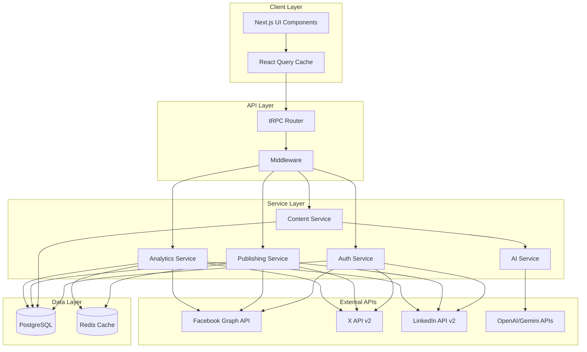
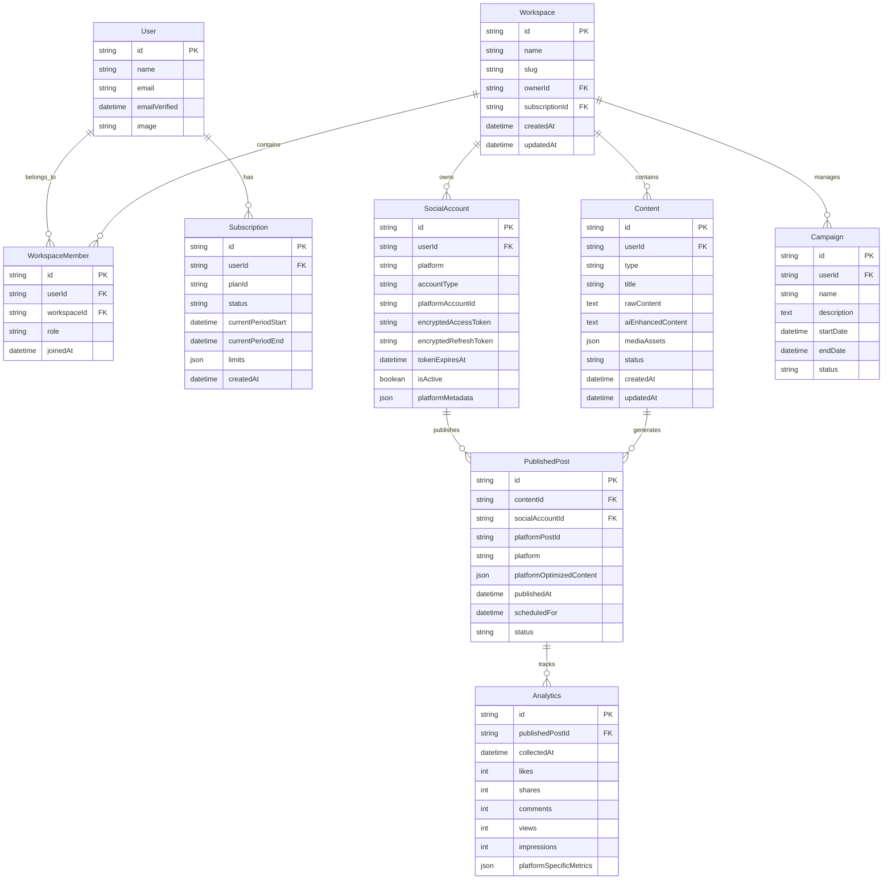

# Design Document

## Overview

This design document outlines the architecture for an AI-powered social media management platform built on the T3 stack (Next.js, Prisma, tRPC, TypeScript). The system will enable users to create, optimize, publish, and analyze content across Facebook, X (Twitter), and LinkedIn while maintaining strong type safety and following KISS/YAGNI principles.

The platform consists of four main subsystems:
1. **Authentication & Account Management** - OAuth integration with social platforms
2. **Content Management** - AI-powered content creation and optimization
3. **Publishing Engine** - Multi-platform content distribution
4. **Analytics Engine** - Real-time metrics collection and insights

## Architecture

### High-Level Architecture



### Database Architecture

The system extends the existing Prisma schema with new models for social media management:



## Components and Interfaces

### 1. Workspace & Subscription Management

**Purpose**: Handle multi-tenant workspace structure and subscription-based access control.

**Key Components**:
- `WorkspaceService`: Workspace creation, member management, and access control
- `SubscriptionService`: Plan management, usage tracking, and billing integration
- `AccessControlService`: Role-based permissions and feature gating
- `UsageTracker`: Monitor workspace usage against subscription limits

**Interfaces**:
```typescript
interface WorkspaceService {
  createWorkspace(userId: string, name: string): Promise<Workspace>;
  inviteMember(workspaceId: string, email: string, role: WorkspaceRole): Promise<WorkspaceInvite>;
  updateMemberRole(workspaceId: string, userId: string, role: WorkspaceRole): Promise<void>;
  getWorkspaceUsage(workspaceId: string): Promise<WorkspaceUsage>;
}

interface SubscriptionService {
  createSubscription(userId: string, planId: string): Promise<Subscription>;
  updateSubscription(userId: string, planId: string): Promise<Subscription>;
  checkFeatureAccess(workspaceId: string, feature: Feature): Promise<boolean>;
  trackUsage(workspaceId: string, resource: Resource, amount: number): Promise<void>;
}

interface Workspace {
  id: string;
  name: string;
  slug: string;
  ownerId: string;
  subscription?: Subscription;
  members: WorkspaceMember[];
}

interface WorkspaceUsage {
  socialAccounts: { used: number; limit: number };
  monthlyPosts: { used: number; limit: number };
  teamMembers: { used: number; limit: number };
}

enum WorkspaceRole {
  OWNER = 'owner',
  ADMIN = 'admin',
  MEMBER = 'member',
  VIEWER = 'viewer'
}

enum Feature {
  AI_CONTENT_GENERATION = 'ai_content_generation',
  ADVANCED_ANALYTICS = 'advanced_analytics',
  TEAM_COLLABORATION = 'team_collaboration',
  BULK_SCHEDULING = 'bulk_scheduling'
}
```

### 2. Authentication Service

**Purpose**: Manage OAuth flows and secure credential storage for social media platforms.

**Key Components**:
- `SocialAuthProvider`: Abstract base class for platform-specific OAuth implementations
- `FacebookAuthProvider`: Facebook Graph API OAuth implementation
- `XAuthProvider`: X API v2 OAuth implementation  
- `LinkedInAuthProvider`: LinkedIn API v2 OAuth implementation
- `CredentialManager`: Encrypted storage and retrieval of access tokens

**Interfaces**:
```typescript
interface SocialAuthProvider {
  platform: SocialPlatform;
  initiateAuth(workspaceId: string, accountType: AccountType): Promise<AuthUrl>;
  handleCallback(code: string, state: string): Promise<SocialAccount>;
  refreshToken(accountId: string): Promise<void>;
  revokeAccess(accountId: string): Promise<void>;
}

interface SocialAccount {
  id: string;
  platform: SocialPlatform;
  accountType: AccountType;
  platformAccountId: string;
  displayName: string;
  isActive: boolean;
  permissions: string[];
}

enum SocialPlatform {
  FACEBOOK = 'facebook',
  X = 'x',
  LINKEDIN = 'linkedin'
}

enum AccountType {
  PERSONAL = 'personal',
  BUSINESS = 'business',
  PAGE = 'page'
}
```

### 3. Content Management Service

**Purpose**: Handle content creation, AI enhancement, and platform optimization.

**Key Components**:
- `ContentCreator`: Core content creation and editing functionality
- `AIContentEnhancer`: Integration with AI APIs for content generation and polishing
- `PlatformOptimizer`: Platform-specific content optimization
- `MediaProcessor`: Image and video processing for different platforms

**Interfaces**:
```typescript
interface ContentService {
  createContent(workspaceId: string, userId: string, input: ContentInput): Promise<Content>;
  enhanceWithAI(contentId: string, enhancement: AIEnhancement): Promise<Content>;
  optimizeForPlatforms(contentId: string, platforms: SocialPlatform[]): Promise<OptimizedContent[]>;
  saveAsDraft(contentId: string): Promise<void>;
}

interface ContentInput {
  type: ContentType;
  title: string;
  rawContent: string;
  mediaAssets?: MediaAsset[];
  targetPlatforms: SocialPlatform[];
}

interface AIEnhancement {
  type: 'polish' | 'generate';
  prompt?: string;
  tone?: string;
  length?: 'short' | 'medium' | 'long';
}

interface OptimizedContent {
  platform: SocialPlatform;
  content: string;
  mediaAssets: ProcessedMediaAsset[];
  hashtags: string[];
  metadata: PlatformMetadata;
}
```

### 4. Publishing Service

**Purpose**: Handle content scheduling and multi-platform publishing.

**Key Components**:
- `PublishingEngine`: Core publishing logic and scheduling
- `PlatformPublisher`: Abstract base for platform-specific publishing
- `FacebookPublisher`: Facebook-specific publishing implementation
- `XPublisher`: X-specific publishing implementation
- `LinkedInPublisher`: LinkedIn-specific publishing implementation
- `SchedulingManager`: Queue management for scheduled posts

**Interfaces**:
```typescript
interface PublishingService {
  publishNow(contentId: string, accountIds: string[]): Promise<PublishedPost[]>;
  schedulePost(contentId: string, accountIds: string[], scheduledFor: Date): Promise<ScheduledPost[]>;
  cancelScheduledPost(scheduledPostId: string): Promise<void>;
  getPublishingStatus(contentId: string): Promise<PublishingStatus>;
}

interface PlatformPublisher {
  platform: SocialPlatform;
  publish(account: SocialAccount, content: OptimizedContent): Promise<PlatformPostResult>;
  validateContent(content: OptimizedContent): Promise<ValidationResult>;
}

interface PublishedPost {
  id: string;
  contentId: string;
  platform: SocialPlatform;
  platformPostId: string;
  publishedAt: Date;
  status: PublishStatus;
}
```

### 5. Analytics Service

**Purpose**: Collect, store, and analyze social media metrics.

**Key Components**:
- `AnalyticsCollector`: Scheduled collection of metrics from platforms
- `MetricsAggregator`: Data processing and insight generation
- `PlatformAnalytics`: Platform-specific metrics collection
- `InsightEngine`: AI-powered analytics insights and recommendations

**Interfaces**:
```typescript
interface AnalyticsService {
  collectMetrics(publishedPostId: string): Promise<Analytics>;
  getPostAnalytics(publishedPostId: string, timeRange: TimeRange): Promise<AnalyticsData>;
  getAggregatedAnalytics(workspaceId: string, filters: AnalyticsFilters): Promise<AggregatedAnalytics>;
  generateInsights(workspaceId: string): Promise<Insight[]>;
}

interface AnalyticsData {
  publishedPostId: string;
  platform: SocialPlatform;
  metrics: TimeSeriesMetric[];
  summary: MetricsSummary;
}

interface TimeSeriesMetric {
  timestamp: Date;
  likes: number;
  shares: number;
  comments: number;
  views: number;
  impressions: number;
  platformSpecific: Record<string, number>;
}
```

## Data Models

### Extended Prisma Schema

```prisma
model Workspace {
  id             String   @id @default(cuid())
  name           String
  slug           String   @unique
  ownerId        String
  subscriptionId String?
  createdAt      DateTime @default(now())
  updatedAt      DateTime @updatedAt
  
  owner          User               @relation("WorkspaceOwner", fields: [ownerId], references: [id], onDelete: Cascade)
  subscription   Subscription?      @relation(fields: [subscriptionId], references: [id])
  members        WorkspaceMember[]
  socialAccounts SocialAccount[]
  content        Content[]
  campaigns      Campaign[]
  
  @@index([ownerId])
  @@index([slug])
}

model WorkspaceMember {
  id          String   @id @default(cuid())
  userId      String
  workspaceId String
  role        String   @default("member") // 'owner', 'admin', 'member', 'viewer'
  joinedAt    DateTime @default(now())
  
  user      User      @relation(fields: [userId], references: [id], onDelete: Cascade)
  workspace Workspace @relation(fields: [workspaceId], references: [id], onDelete: Cascade)
  
  @@unique([userId, workspaceId])
  @@index([workspaceId, role])
}

model Subscription {
  id                   String   @id @default(cuid())
  userId               String
  planId               String   // 'free', 'pro', 'enterprise'
  status               String   // 'active', 'cancelled', 'past_due', 'trialing'
  currentPeriodStart   DateTime
  currentPeriodEnd     DateTime
  limits               Json     // Plan-specific limits (posts/month, accounts, etc.)
  stripeCustomerId     String?
  stripeSubscriptionId String?
  createdAt            DateTime @default(now())
  updatedAt            DateTime @updatedAt
  
  user       User        @relation(fields: [userId], references: [id], onDelete: Cascade)
  workspaces Workspace[]
  
  @@unique([userId])
  @@index([status])
  @@index([currentPeriodEnd])
}

model SocialAccount {
  id                    String   @id @default(cuid())
  workspaceId           String
  platform              String   // 'facebook', 'x', 'linkedin'
  accountType           String   // 'personal', 'business', 'page'
  platformAccountId     String
  displayName           String
  encryptedAccessToken  String
  encryptedRefreshToken String?
  tokenExpiresAt        DateTime?
  isActive              Boolean  @default(true)
  permissions           Json     // Array of granted permissions
  platformMetadata      Json     // Platform-specific data
  createdAt             DateTime @default(now())
  updatedAt             DateTime @updatedAt
  
  workspace      Workspace       @relation(fields: [workspaceId], references: [id], onDelete: Cascade)
  publishedPosts PublishedPost[]
  
  @@unique([workspaceId, platform, platformAccountId])
  @@index([workspaceId, platform])
}

model Content {
  id                String   @id @default(cuid())
  workspaceId       String
  createdById       String
  type              String   // 'text', 'image', 'video'
  title             String
  rawContent        String   @db.Text
  aiEnhancedContent String?  @db.Text
  mediaAssets       Json?    // Array of media asset references
  status            String   @default("draft") // 'draft', 'ready', 'published'
  createdAt         DateTime @default(now())
  updatedAt         DateTime @updatedAt
  
  workspace      Workspace       @relation(fields: [workspaceId], references: [id], onDelete: Cascade)
  createdBy      User            @relation(fields: [createdById], references: [id], onDelete: Cascade)
  publishedPosts PublishedPost[]
  
  @@index([workspaceId, status])
  @@index([createdById])
  @@index([createdAt])
}

model PublishedPost {
  id                        String   @id @default(cuid())
  contentId                 String
  socialAccountId           String
  platformPostId            String
  platform                  String
  platformOptimizedContent  Json     // Platform-specific optimized content
  publishedAt               DateTime?
  scheduledFor              DateTime?
  status                    String   @default("pending") // 'pending', 'published', 'failed', 'cancelled'
  errorMessage              String?
  retryCount                Int      @default(0)
  createdAt                 DateTime @default(now())
  updatedAt                 DateTime @updatedAt
  
  content       Content       @relation(fields: [contentId], references: [id], onDelete: Cascade)
  socialAccount SocialAccount @relation(fields: [socialAccountId], references: [id], onDelete: Cascade)
  analytics     Analytics[]
  
  @@unique([socialAccountId, platformPostId])
  @@index([status, scheduledFor])
  @@index([contentId])
}

model Analytics {
  id               String   @id @default(cuid())
  publishedPostId  String
  collectedAt      DateTime
  likes            Int      @default(0)
  shares           Int      @default(0)
  comments         Int      @default(0)
  views            Int      @default(0)
  impressions      Int      @default(0)
  platformSpecific Json     // Platform-specific metrics
  createdAt        DateTime @default(now())
  
  publishedPost PublishedPost @relation(fields: [publishedPostId], references: [id], onDelete: Cascade)
  
  @@unique([publishedPostId, collectedAt])
  @@index([publishedPostId, collectedAt])
}
```

## Error Handling

### Error Classification

1. **Authentication Errors**
   - Token expiration: Automatic refresh attempt, fallback to user re-auth
   - Invalid credentials: Immediate user notification and re-auth prompt
   - Permission denied: Clear error message with required permissions

2. **Content Processing Errors**
   - AI API failures: Graceful degradation to manual content creation
   - Media processing errors: Format validation and conversion suggestions
   - Content validation errors: Clear feedback with correction suggestions

3. **Publishing Errors**
   - Platform API failures: Retry with exponential backoff, queue for later
   - Rate limiting: Respect platform limits, schedule retry
   - Content policy violations: User notification with platform guidelines

4. **Analytics Collection Errors**
   - API unavailability: Continue collection on next interval
   - Data inconsistencies: Log for investigation, use cached data
   - Rate limiting: Implement collection throttling

### Error Recovery Strategies

```typescript
interface ErrorHandler {
  handleAuthError(error: AuthError): Promise<ErrorRecovery>;
  handlePublishingError(error: PublishingError): Promise<ErrorRecovery>;
  handleAnalyticsError(error: AnalyticsError): Promise<ErrorRecovery>;
}

interface ErrorRecovery {
  action: 'retry' | 'fallback' | 'notify' | 'ignore';
  retryAfter?: number;
  fallbackStrategy?: string;
  userMessage?: string;
}
```

## Testing Strategy

### Unit Testing
- **Service Layer**: Mock external APIs, test business logic
- **Data Layer**: Test Prisma models and database operations
- **Utility Functions**: Test content optimization and validation logic

### Integration Testing
- **API Endpoints**: Test tRPC procedures with real database
- **OAuth Flows**: Test authentication with platform sandbox environments
- **Publishing Pipeline**: End-to-end testing with test social accounts

### End-to-End Testing
- **User Workflows**: Complete user journeys from content creation to analytics
- **Multi-Platform Publishing**: Verify content appears correctly on all platforms
- **Analytics Collection**: Verify metrics are collected and displayed accurately

### Testing Tools
- **Jest**: Unit and integration testing
- **Playwright**: End-to-end testing
- **MSW**: API mocking for external services
- **Prisma Test Environment**: Isolated database testing

### Test Data Management
- **Fixtures**: Standardized test data for consistent testing
- **Factories**: Dynamic test data generation
- **Cleanup**: Automated test data cleanup between tests

## Security Considerations

### Credential Security
- **Encryption**: AES-256 encryption for all stored tokens
- **Key Management**: Environment-based encryption keys with rotation
- **Access Control**: Role-based access to social accounts

### API Security
- **Rate Limiting**: Implement rate limiting on all endpoints
- **Input Validation**: Strict validation using Zod schemas
- **CORS**: Proper CORS configuration for API endpoints

### Data Privacy
- **GDPR Compliance**: User data deletion and export capabilities
- **Audit Logging**: Track all access to sensitive data
- **Data Minimization**: Store only necessary user data

## Performance Optimization

### Caching Strategy
- **Redis**: Cache frequently accessed data (user profiles, analytics)
- **React Query**: Client-side caching for UI responsiveness
- **Database Indexing**: Optimize queries with proper indexes

### Background Processing
- **Queue System**: Use Redis for job queuing (publishing, analytics collection)
- **Batch Processing**: Batch analytics collection to reduce API calls
- **Scheduled Tasks**: Cron jobs for token refresh and cleanup

### Monitoring
- **Application Metrics**: Track API response times and error rates
- **Database Performance**: Monitor query performance and connection pooling
- **External API Health**: Track third-party API availability and response times